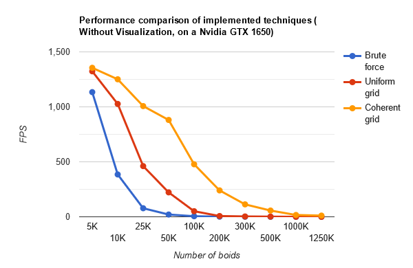
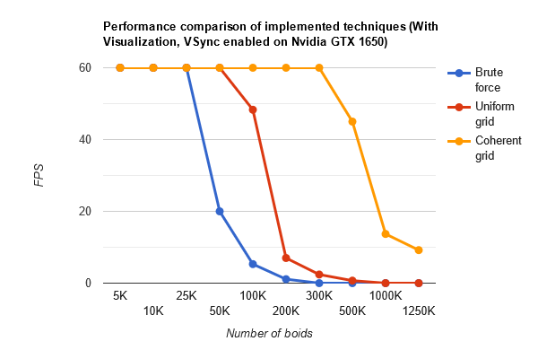

## **Cuda Flocking Boids Simulation**

## Showcase
(Simulation with 10K particles)

(Simulation with 25K particles)

## Description
A simple boids simulation done using Cuda and C++. \
Techniques implemented :
  * **Brute Force** approach (Each boid iterates over every other boid).
  * **Uniform grid** approach (Each boid iterates over boids only in neighbouring spatial grids).
  * **Coherent grid** approach (Similar to Uniform grid, but memory access is more linear (fewer indrections required)).
  

> Starting code / template obtained from : https://github.com/CIS565-Fall-2022/Project1-CUDA-Flocking.

**Performance Analysis**

 

## References
